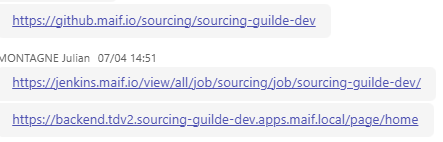
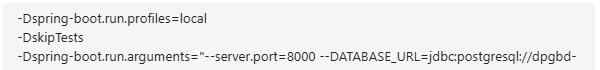
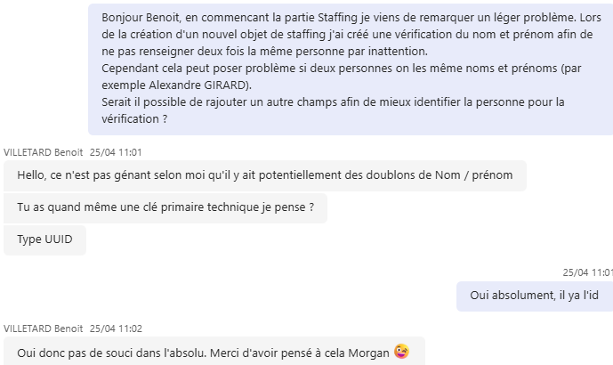
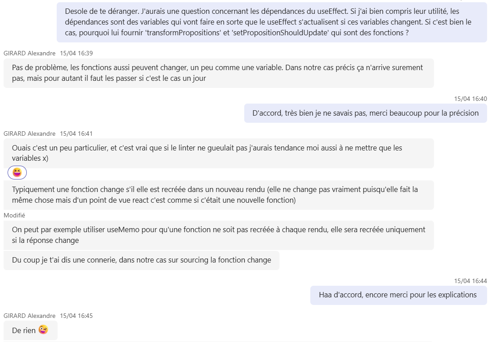
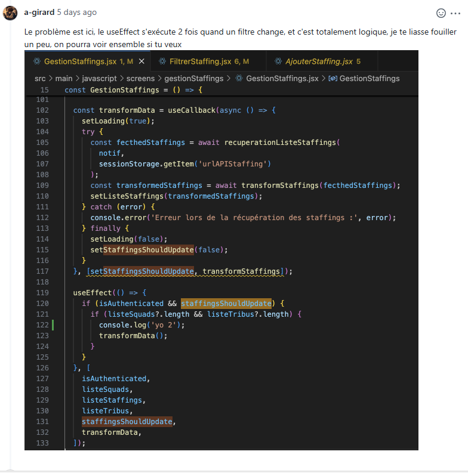
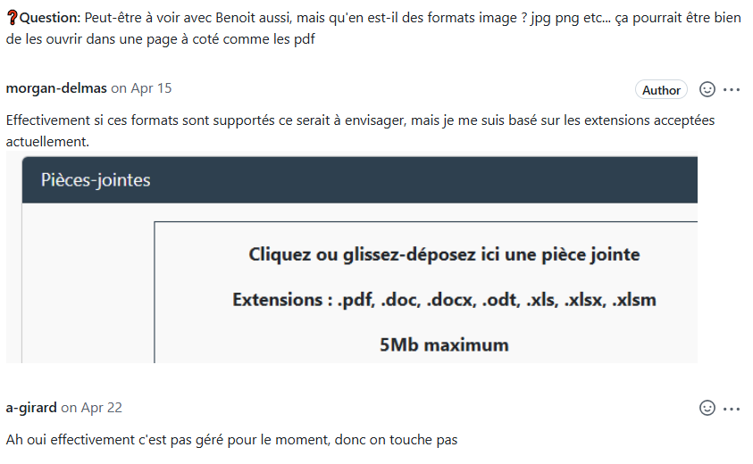
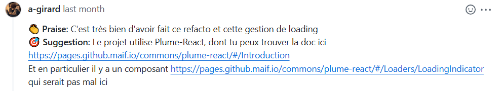

# La communication

---

## Echanges par Teams

#### Pour commencer

- Les liens utiles :  

- Des configuration :  

#### Des questions

- Besoins de précisions sur les HU :  

- Questions techniques :  

---

## Echanges par les commentaires sur GitHub

On m'indique qu'il y a une erreur, tout en me laissant en chercher la cause afin que je puisse comprendre et apprendre pour une prochaine fois :  

De simples questions :  

Et même des compliments :  

---

Je tiens à remercier [Manison RATTANAXAY](https://fr.linkedin.com/in/manison-rattanaxay-78406622) et à [Alexandre GIRARD](https://www.linkedin.com/in/alexandre-girard-314232199).  
Deux développeurs incroyables qui m'ont beaucoup aidés et appris de nombreuses choses.

