# Feature : Archivage multiple

## ✅ Objectif

Ajouter une colonne dans le tableau des propositions permettant de sélectionner plusieurs propositions afin de les archiver en une seule fois.

---

## 🎫 Ticket

**En tant que** RE, **je souhaite** pouvoir “archiver” plusieurs propositions.

Sur la liste des propositions, j’ai possibilité de sélectionner plusieurs propositions puis de cliquer sur un bouton “Archiver”.
Un popup me demande de confirmer l’archivage.

Si je confirme, les propositions sélectionnées passent au statut “Archivé”.

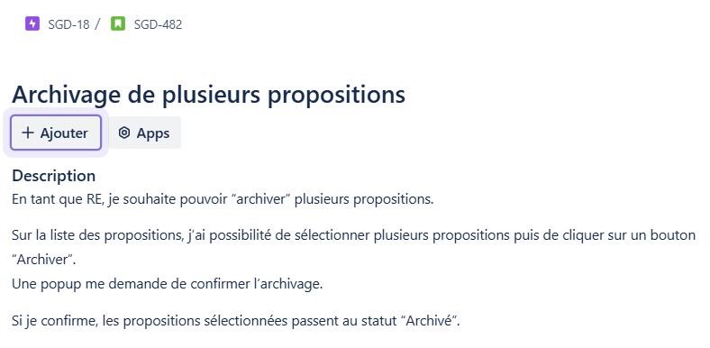

---

## 🧠 Contexte initial

Jusqu'à présent, pour archiver une proposition, il fallait :
- Se rendre sur la page de détail de chaque proposition.
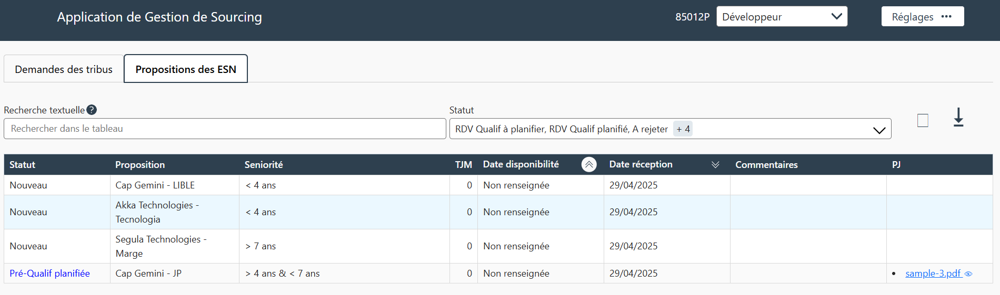

- Modifier manuellement son statut à `Archivé sans donner de suite`.
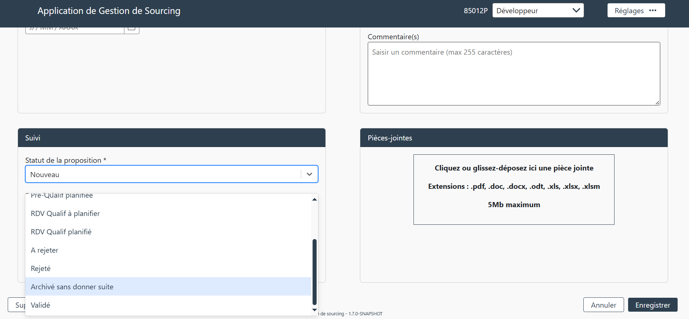

Ce processus était long et peu pratique pour un archivage en masse.

---

## 🔍 Constat technique

### Ce qui existait

#### Côté **Back-end**

L’API ne proposait que les opérations CRUD de base :
- **Create**
- **Read**
- **Update**
- **Delete**

Aucune route spécifique pour l’archivage multiple n’existait.  
Le controller pour mettre à jour une proposition n'en prenait qu'une seule à la fois, 
de plus il fallait repréciser tous les attributs, même s'ils ne changeaient pas.

#### 📸 Captures d’écran :
- Déclaration du controller :  
  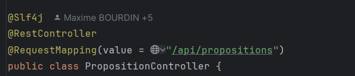

- Mise à jour d'une proposition (controller) :  
  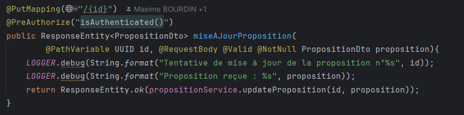

- Mise à jour d'une proposition (service) :  
  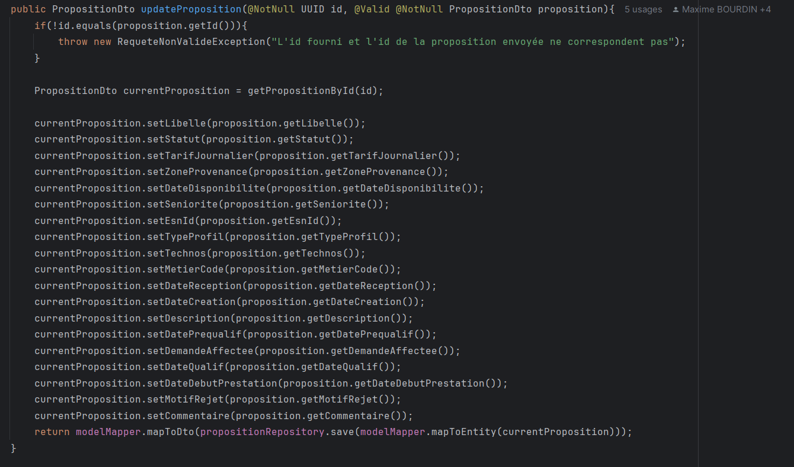

#### Côté **Front**

#### 📸 Captures d’écran :
- Appel au composant `Table` :  
  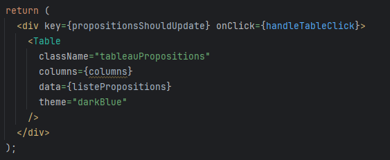  
Il s'agit d'un composant de la bibliothèque Plume (interne Maif).  
La props columns prend une liste d'objet dont l'attribut name définira le nom des colonnes du tableau.  
La props data, quant à elle, prend une liste d'objet qui sera afficher dans le tableau.

- Colonnes avant :  
  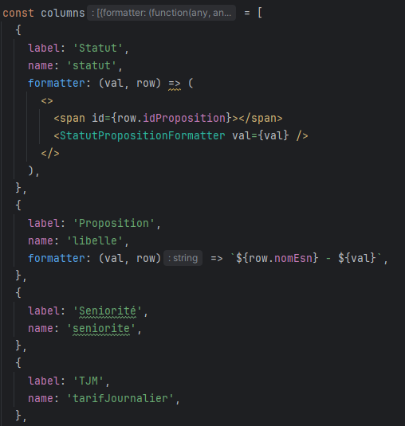

- Rendu :
  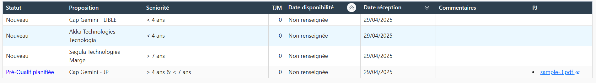

---

## 🛠️ Ce qui a été mis en place

### Côté **Back-end**

#### ✅ Ajouts :
- **Nouveaux contrôleurs** capables de recevoir un ou plusieurs `id` de propositions.
- **Services associés** qui modifient le statut de chaque proposition en `Archivé`.

#### 📸 Captures d’écran :

- Nouveau controller pour archivage multiple :  
  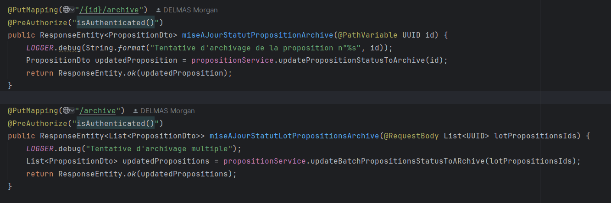
  Soit, il y a une seule proposition à archiver : on passe l'id de la proposition comme paramètre de la route et on ne fournit pas de body.  
  Soit, il y a plusieurs propositions à archiver : on passe une liste d'id dans le body, mais cette fois la route n'a pas de paramètre.

- Nouveau service pour archivage multiple :  
  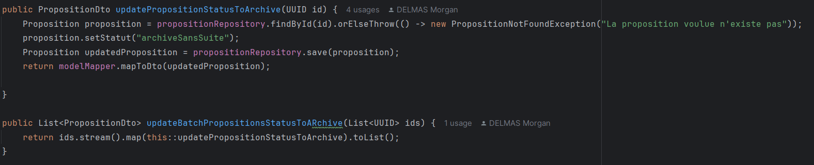
Afin de changer le statut d'une proposition, on commence par vérifier qu'elle existe, ensuite, on change son statut à `ArchiverSansSuite` et enfin, on sauvegarde la modification.  
Pour en traiter plusieurs, on effectue une map sur la liste et on traite chaque objet avec la méthode précédente.

---

### Côté **Front-end**

#### ✅ Étapes :
1. Ajout d’une **colonne de cases à cocher** dans le tableau des propositions.
2. Création d’un **state global** `propositionsToArchive` via le `AppContext`.
3. Ajout d’un **bouton "Archiver"** déclenchant un popup de confirmation.
4. Envoi de la liste des `id` sélectionnés à l’API.

#### 📸 Captures d’écran :
- Colonnes après :  
  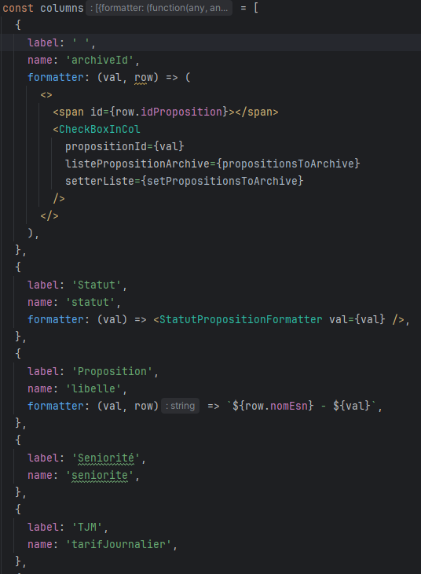  
On ajoute une colonne sans nom afin de pouvoir afficher les checkbox.

- Composant Checkbox dans la colonne :  
  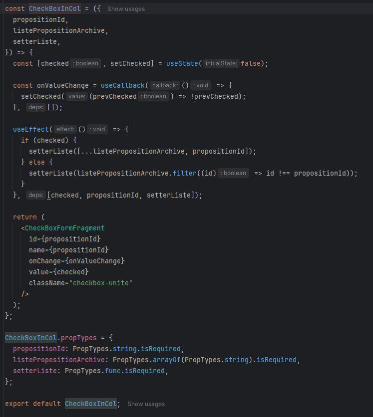  
Je me rends compte avec du recul que ce composant pourrait être amélioré, notamment en accédant directement au contexte plutôt que de passer les props.
De plus, seul la variable `checked` est utile comme dépendance du useEffect.  
Ceci mis à part, ce composant gère l'ajout et le retrait d'un id dans la liste

- Création d'un state `propositionsToArchive` dans le fichier App :
  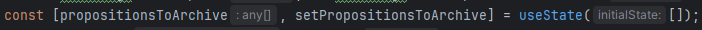

- Le state est stocké dans une variable avec d'autres states puis passé au context :
  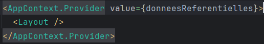

- Accès à la liste depuis le `AppContext` :  
  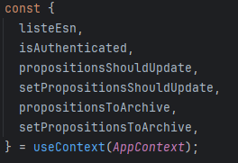

- Rendu du bouton permettant l'archivage :
  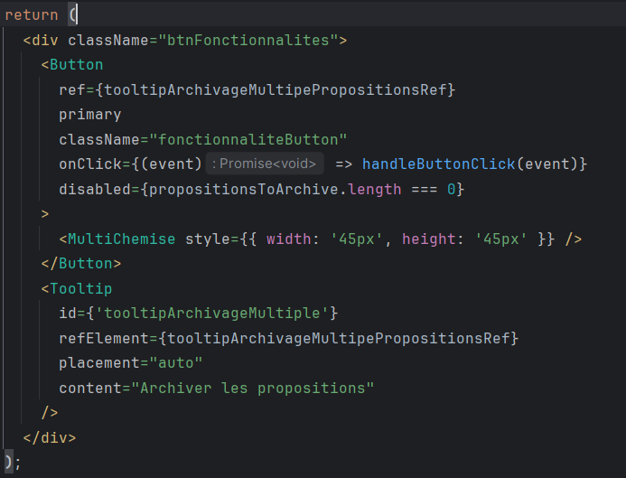  
Le bouton est désactivé s'il n'y a aucune proposition de sélectionnée.

- Envoi de la liste lorsque l'on appuie sur le bouton :
  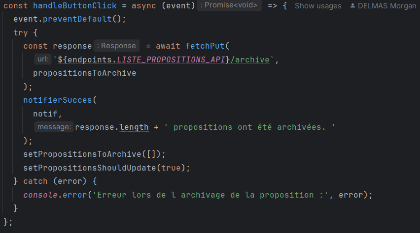
Il existe dans les utils de l'appli des méthodes facilitant les appels API.
Il suffit de fournir la route et le contenu à placer dans le body et le reste est traité par la méthode.  
Une fois la liste envoyée, il ne reste plus qu'à vider cette dernière et à actualiser le tableau. 

---

## ✅ Résultat

- Archivage multiple possible en quelques clics.
- Gain de temps significatif pour les utilisateurs.

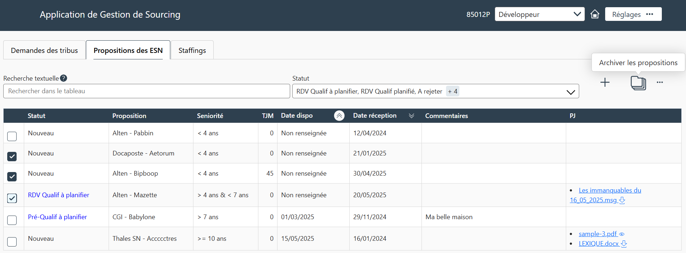

