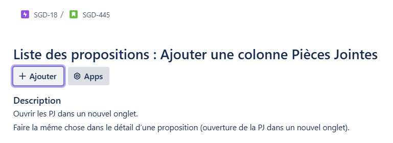
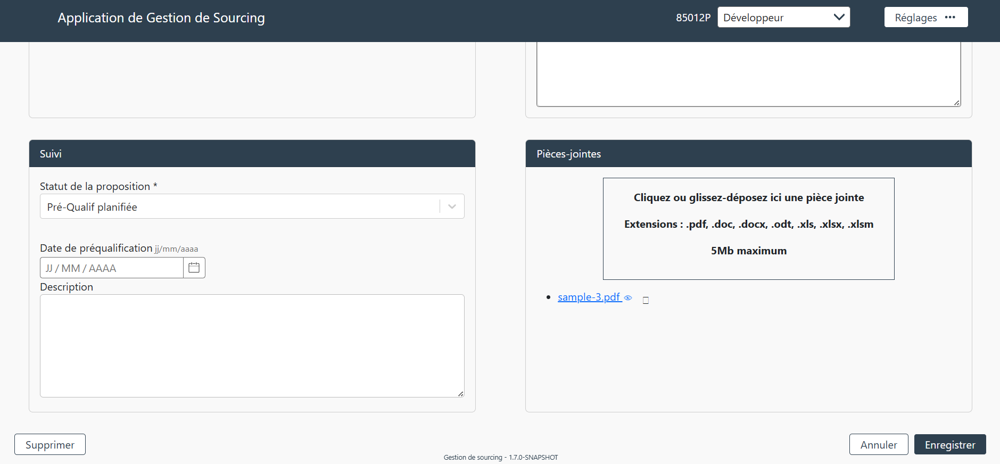
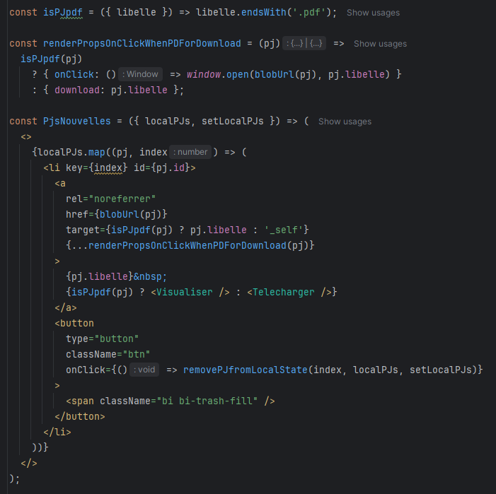
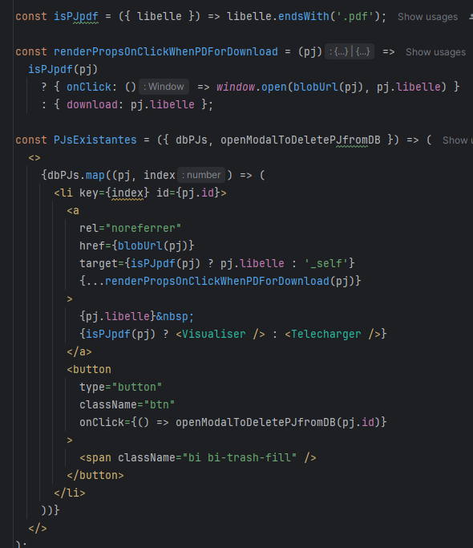
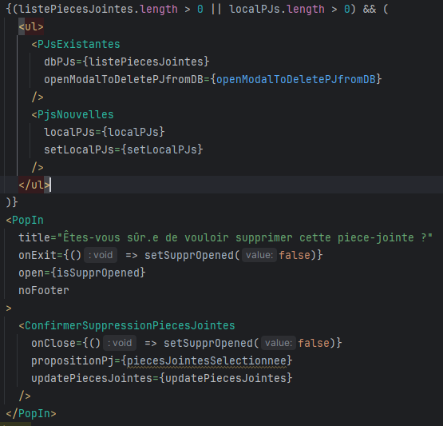
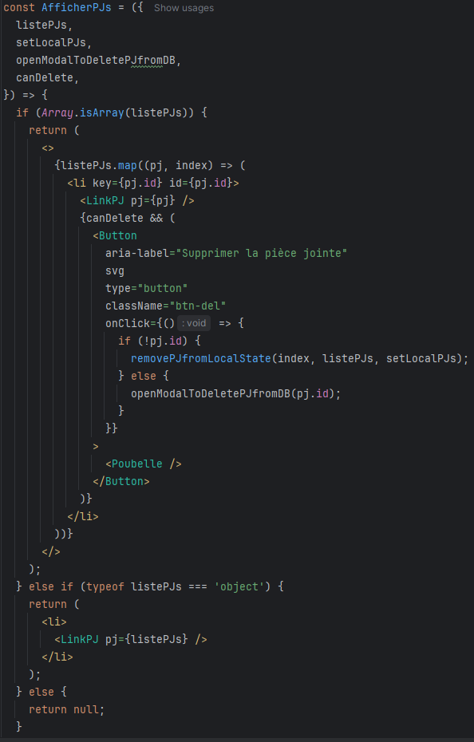
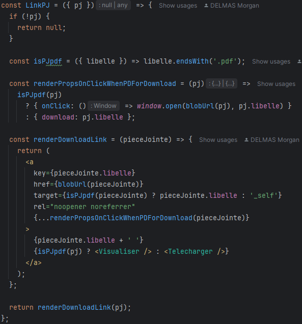
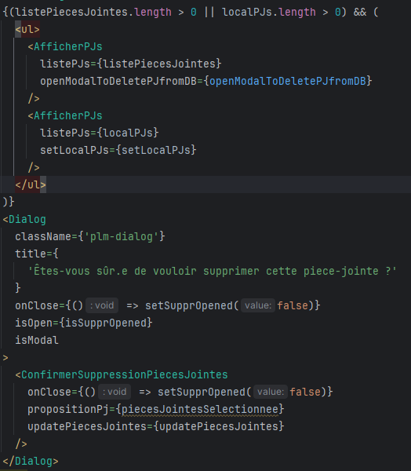
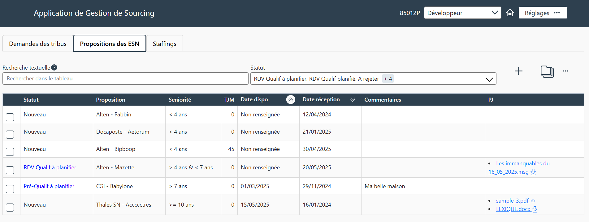

# Feature : Colonne Pièces jointes

## ✅ Objectif

Ajouter une colonne dans le tableau des propositions permettant d'afficher les pièces jointes.

---

## 🎫 Ticket

Ouvrir les PJ dans un nouvel onglet.  
Faire la même chose dans le détail d’une proposition (ouverture de la PJ dans un nouvel onglet).

---

## 🧠 Contexte initial

Jusqu'à présent, pour savoir si une proposition avait des pièces jointes, il fallait :
- Se rendre sur les pages de détail des propositions une par une.

---

## 🔍 Constat technique

### Ce qui existait

- Composant `PjsExistantes` pour afficher les pièces jointes existantes.
- Composant `PjsNouvelles` pour afficher les nouvelles pièces jointes.

### Ce que j'ai remarqué

Il y a bien une différence au niveau de la gestion des nouvelles pièces jointes et celles déjà existantes.
Les nouvelles pièces jointes ne sont enregistrées que lorsque le formulaire de création ou de modification est validé.
Il est donc normal qu'il existe deux listes pour les pièces jointes : celles déjà enregistrées et les nouvelles.
Cependant, la seule différence notable entre les deux composants existants était la façon dont la pièce jointe était supprimée.

#### 📸 Captures d’écran avant refactorisation :
- `PJsNouvelles`  

- `PJsExistantes`  

- Appels dans `ModifierPropositions`  

---

## 🛠️ Ce qui a été mis en place

#### ✅ Ajouts :
- Refactorisation des composants pour rassembler la gestion des pièces jointes en un seul composant avec une condition supplémentaire.
- Création d’un deuxième composant pour l'affichage des pièces jointes.
- Ajout d’une props booléenne pour afficher ou non le bouton de suppression.

#### 📸 Captures d’écran après refactorisation :
- `AfficherPJs`  

- `LinkPJ`  
  

- Appels dans `ModificationPropositions`  

---

## ✅ Résultat

- Affichage des pièces jointes dans le tableau des propositions.
- Code plus modulaire et évolutif.

---

## Retour aux compétences

- [C1 : Réaliser un développement d'application](../Competences/C1-realiser-developpement-application.md)