# Staffing

## Description

La partie staffing est une troisième partie de l'application qui n'existait pas.  
Il s'agissait de créer une première version de cette fonctionnalité afin de voir quels points seraient utiles et ce à quoi il faudrait penser dans le but de la rendre utilisable.

---

### Besoin

À l'heure actuelle, les affectations des personnels au sein de la Maif (du moins pour la DSI) est géré dans un fichier excel 
et si une personne change d'équipe, il n'y a pas de trace de ses affectations précédentes.

---

### Première étape : un modèle back-end

#### 🎫 Ticket

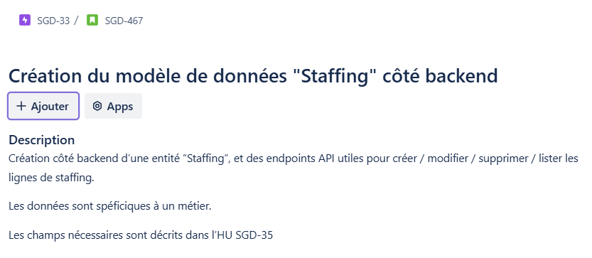

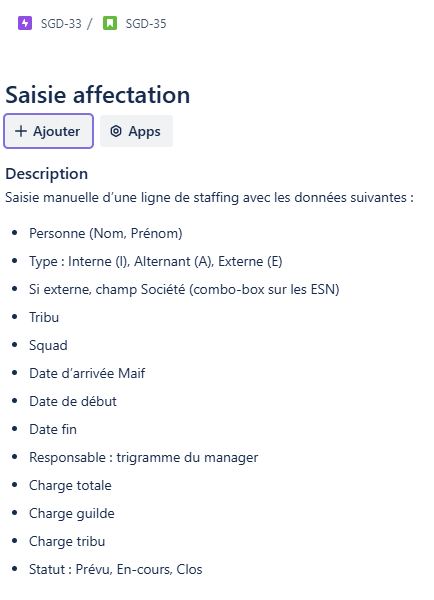

D'après les données requises, j'avais dans un premier temps placé des contraintes sur le type et le statut.
Cependant, lors de la review, mon collègue m'a signalé que cela pourrait potentiellement provoquer quelques problèmes dans le futur si le besoin de l'utilisateur évolue.

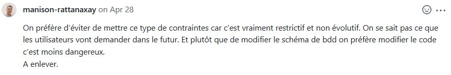

Afin de construire les endpoints de l'API, il a fallu :
+ Le model
+ Le Dto
+ Le mapping (pour faire le lien entre les deux précédents)
+ Le repository
+ Le service
+ Le controller
+ Un gestionnaire d'exception

#### 📸 Captures d’écran

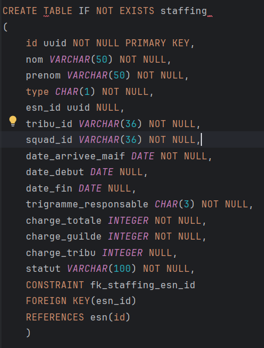

#### ✅ Tests

- Tests du mapping :  
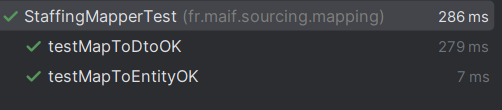

- Tests du controller :  
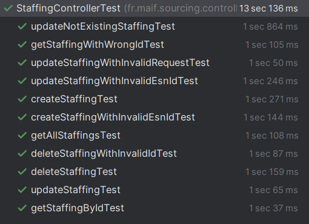

- Tests du service :  
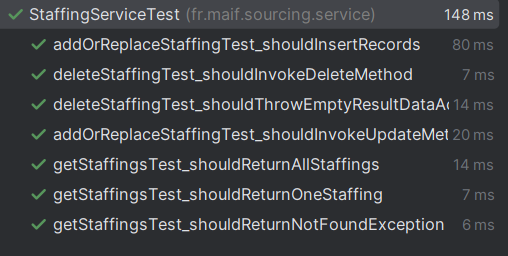

---

### Deuxième étape : lister

#### 🎫 Ticket

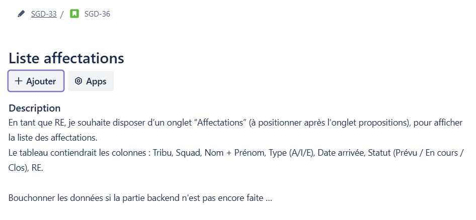

#### 📸 Captures d’écran

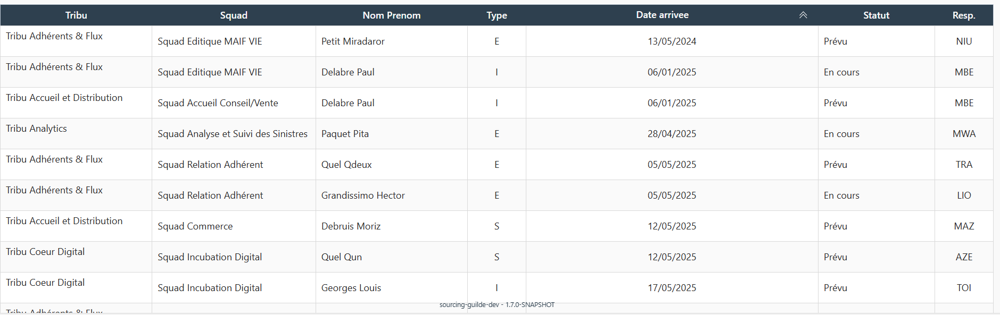

---

### Troisième étape : Ajouter

#### 🎫 Ticket

#### 📸 Captures d’écran

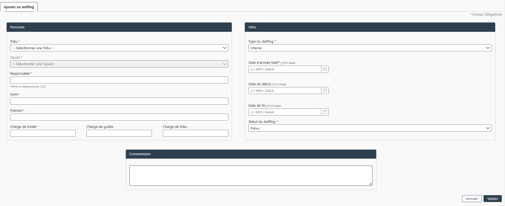

---

### Quatrième étape : Detail

#### 🎫 Ticket

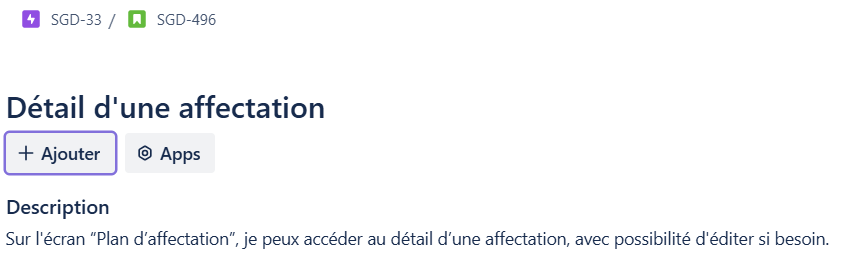

#### 📸 Captures d’écran

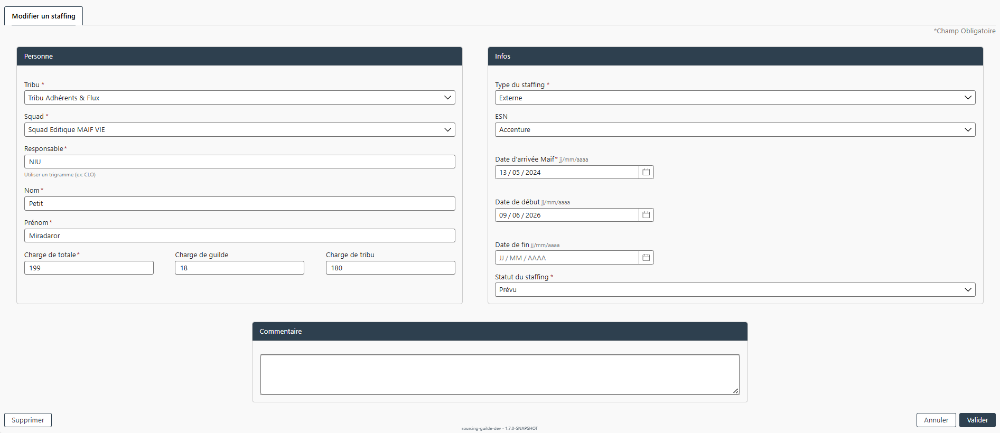

---

### Cinquième étape : Supprimer

#### 🎫 Ticket

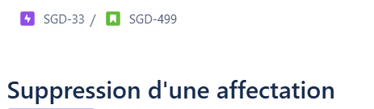

#### 📸 Captures d’écran

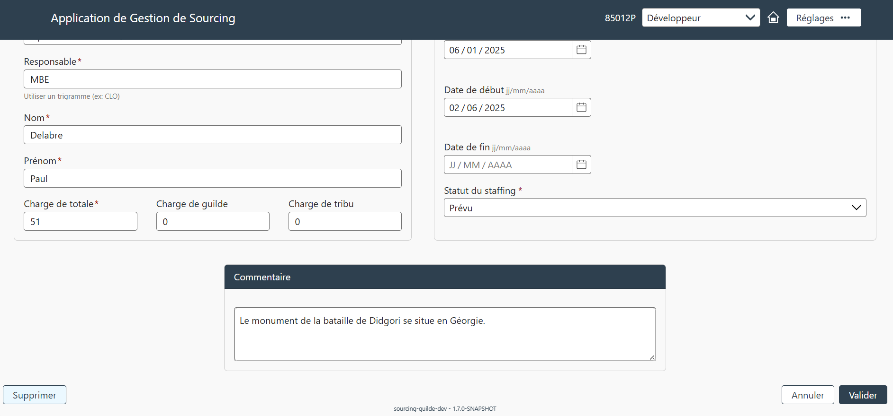

---

### Sixième étape : Filtrer

#### 🎫 Ticket

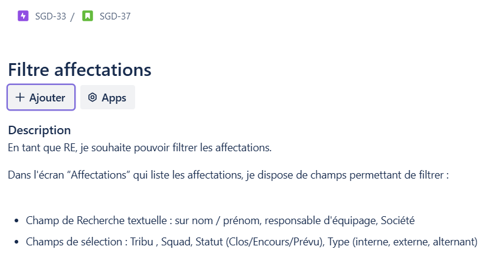

#### 📸 Captures d’écran

---

### Sixième étape : Mise en forme

#### 🎫 Ticket

#### 📸 Captures d’écran

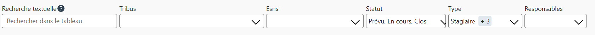

---

### Septième étape : Exporter

#### 🎫 Ticket

#### 📸 Captures d’écran

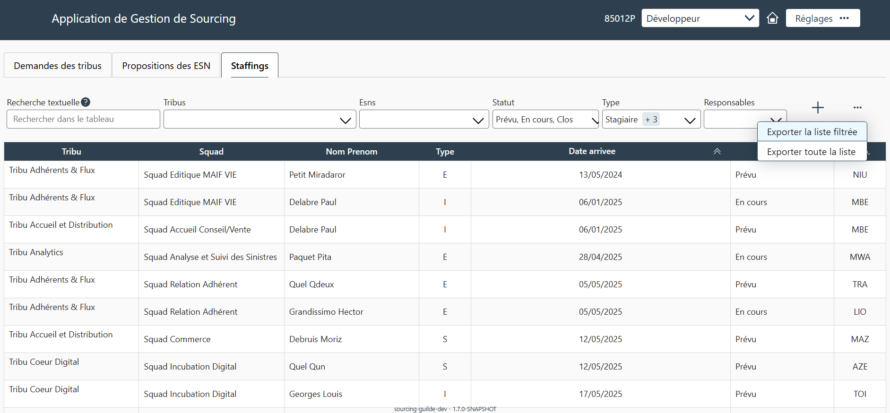

---

### Huitième étape : Champ commentaire

#### 🎫 Ticket

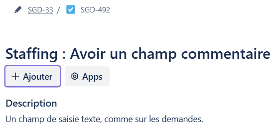

#### 📸 Captures d’écran

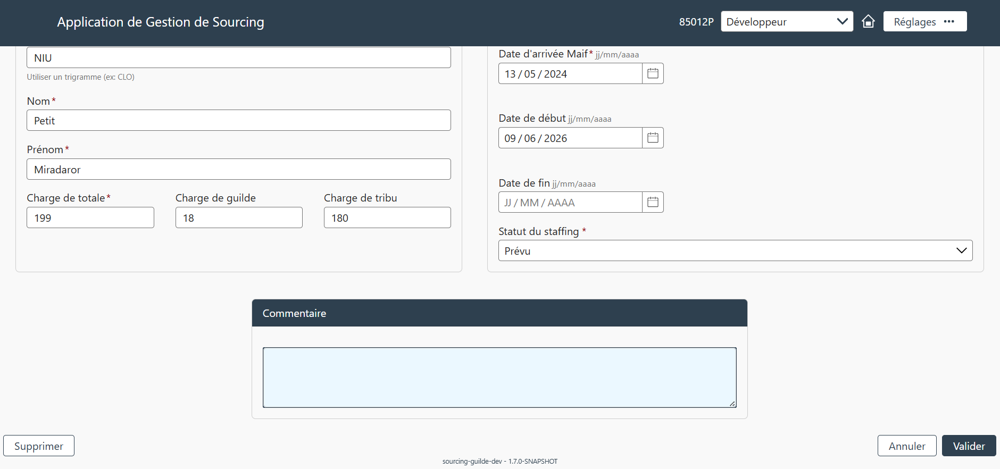

---

### Neuvième étape : Changement d'affectation

#### 🎫 Ticket

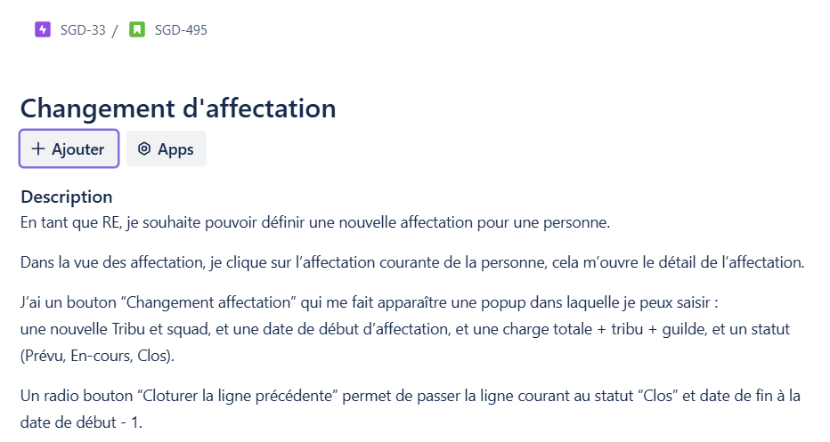

#### 📸 Captures d’écran

---

### Dixième étape : Calcul des charges

#### 🎫 Ticket

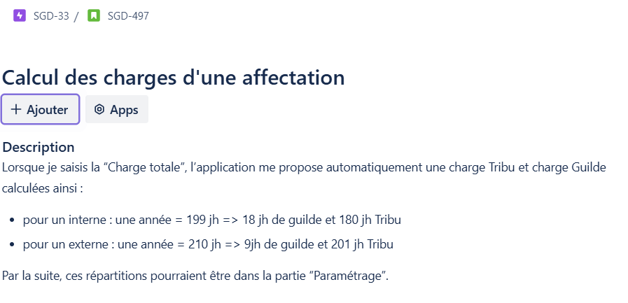

#### 📸 Captures d’écran

