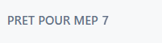
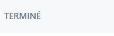
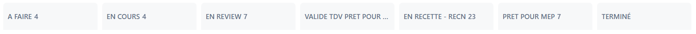
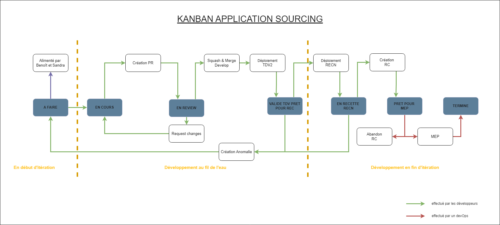

# Organisation du Jira

## 📌 Vue d’ensemble du Kanban

La principale utilisation du Jira est le Tableau Kanban.

Le tableau Kanban est alimenté par les tickets créés dans le backlog.

---

### 📝 Création et gestion des tickets dans le backlog

Dans ce backlog, les tickets sont créés principalement par les Owner, mais également par les Devs si besoin, par exemple en cas d'anomalie sur le projet.  
Les tickets peuvent concerner une feature, une correction ou même quelque chose de plus technique comme une refacto ou une montée de version. Chaque ticket est attribué à une Epic (une catégorie) ce qui permet de s'y retrouver plus simplement et même généralement de mieux comprendre le contenu du ticket.  
À leur création, les tickets sont au statut `Nouveau`.

### 🚀 Déroulement d’un sprint

Lors d'un début de sprint, l'équipe sélectionne les différents tickets qui sont embarqués pour le sprint et leur statut passe à `A Faire` et ils apparaissent alors dans le Kanban.  

### 👨‍💻 Suivi du développement

Lorsqu’un développeur commence à travailler sur un ticket, il est déplacé dans la colonne `En cours`  

Une fois la première version du développement terminée, une Pull Request doit être créée sur Git et attendre une revue de code afin de valider le code produit et sa qualité. Le ticket passe alors au statut `En review`.  

En général, le lien du ticket se trouve dans la description de la PR, afin de faciliter la validation par le relecteur, en s’assurant que ce qui a été produit correspond à ce qui est attendu.  
De plus si des modifications sont nécessaires, le ticket repasse dans la colonne `En cours`.

### ✅ Phases de validation

À l'inverse, une fois la Pull Request validée le code est intégré dans la branche de développement, mais le ticket reste dans la colonne `En review`.  

Il faut attendre un déploiement sur l'environnement tdv2, sans qu'il y ait de problème, avant de pouvoir le déplacer dans la colonne `Validé tdv prêt pour rec`.
'tdv2' est un environnement utilisé pour les tests techniques internes, principalement utilisé par les développeurs.

### ✅ Validation finale et mise en production

Un second déploiement est ensuite nécessaire sur l’environnement recn afin de passer les tickets dans la cinquième colonne : `En recette - recn`.  
'recn' est un environnement destiné aux tests réalisés par les utilisateurs métiers.

À partir de cette étape, les tickets ne sont plus déplacés par les développeurs, mais par les owners et utilisateurs testant le produit.
Une fois que ces derniers ont bien confirmé que ce qui a été fait correspond bien à ce qui était attendu, le ticket peut alors passer en `Prêt pour mep`.

Et finalement, une fois le produit déployé en environnement réel, le ticket peut enfin être considéré comme étant `Terminé`.  

---

## Récapitulatif des statuts du Kanban

Voici les colonnes du tableau en entier :

| **Statut Jira**          | **Description**                                         |
|--------------------------|---------------------------------------------------------|
| Nouveau                  | Ticket créé, en attente de planification                |
| A faire                  | Ticket sélectionné pour le sprint                       |
| En cours                 | Développement en cours                                  |
| En review                | Code en attente de relecture (Pull Request)             |
| Validé tdv prêt pour rec | Déploiement validé sur l’environnement technique (tdv2) |
| En recette - recn        | En cours de test sur l’environnement de recette (recn)  |
| Prêt pour mep            | Ticket validé, prêt à être mis en production            |
| Terminé                  | Ticket déployé en production, tâche finalisée           |

---

##  Schéma du workflow

Schéma du workflow : 

