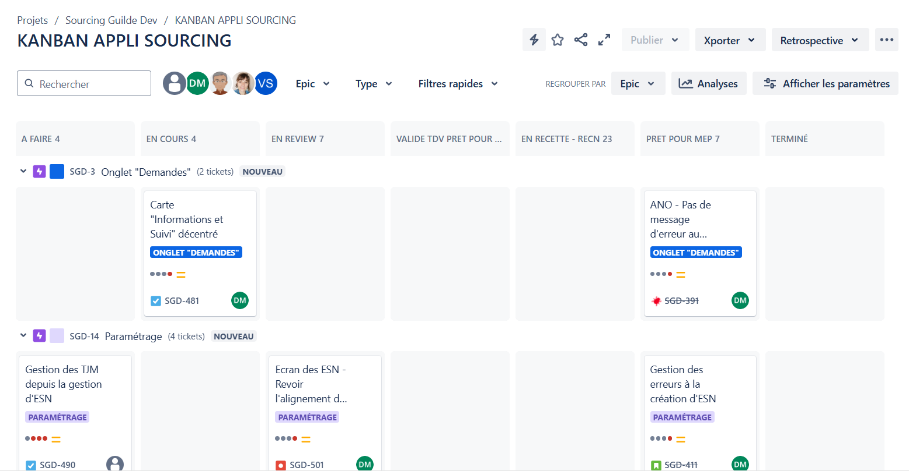
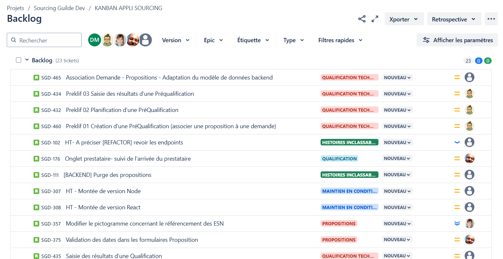
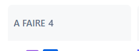
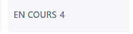
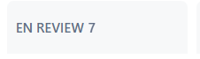
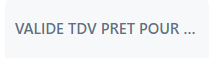
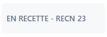

# Organisation du Jira

La principale utilisation du Jira est le Tableau Kanban.

Mais avant cela, le tableau Kanban est alimenté par les tickets issus du backlog.

Dans ce backlog, les tickets sont créés principalement par les Owner, mais également par les Devs si besoin, par exemple en cas d'anomalie sur le projet.  
Les tickets peuvent concerner une feature, une correction ou même quelque chose de plus technique comme une refacto ou une montée de version. Ils sont attribués à une Epic, à une catégorie ce qui permet de s'y retrouver plus simplement et même généralement de mieux comprendre le contenu du ticket.  
À leurs créations, les tickets sont au statut `Nouveau`.

Lors d'un début de sprint, l'équipe sélectionne les différents tickets qui sont embarqués pour le sprint et leurs status passent à `A Faire` et ils apparaissent alors dans le Kanban.  

Lorsque l'on commence à travailler sur un ticket, on le déplace dans la colonne `En cours`  

Une fois la première version du développement terminé, il faut créer une Pull Request sur Git et attendre une review afin de valider le code produit et sa qualité. Le ticket passe alors au statut `En review`.  

En général, le lien du ticket se trouve dans la description de la PR, de sorte qu'il soit plus facile pour le reviewer de valider que ce qui a été produit correspond à ce qui est attendu.  
De plus si des modifications sont nécessaires, le ticket repasse dans la colonne `En cours`.

À l'inverse, une fois la Pull Request validée le code est intégré dans la branch de développement, mais le ticket reste dans la colonne `En review`.  

Il faut attendre un déploiement sur l'environnement tdv2, sans qu'il y ait de problème, avant de pouvoir le déplacer dans la colonne `Validé tdv prêt pour rec`.

Il faut ensuite de nouveau attendre un déploiement sur un autre environnement, sur l'environnement recn, afin de passer les tickets dans la cinquième colonne: `En recette - recn`.  

