# Migration / Refactorisation des composants

## Description

La Maif utilise une bibliothèque de composant react interne.  
Actuellement la bibliothèque utilisée et maintenue est Plume, il s'agit d'une évolution de la précédente : RMC (React Maif Component), qui n'est plus maintenue.

Au fil de mon travail sur le projet, j'ai remarqué qu'il restait un certain nombre de composants qui venait encore de RMC.
Après avoir consulté un collègue afin de m'assurer de la pertinence de la démarche, j'ai pris l'initiative de migrer les composants RMC vers leur équivalent ou leur version plus adaptée sur Plume.

---

### Migrations des composants Input

- Avant :  
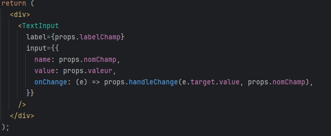

- Apres :  
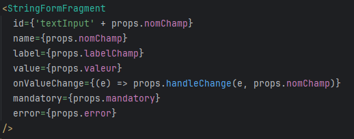

---

### Migration des composants Checkbox

- Avant :  
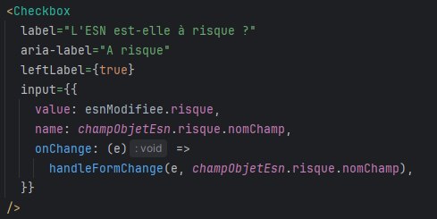

- Apres !  
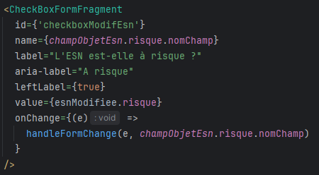

---

### Migration des composants SimpleTable

- Avant :  
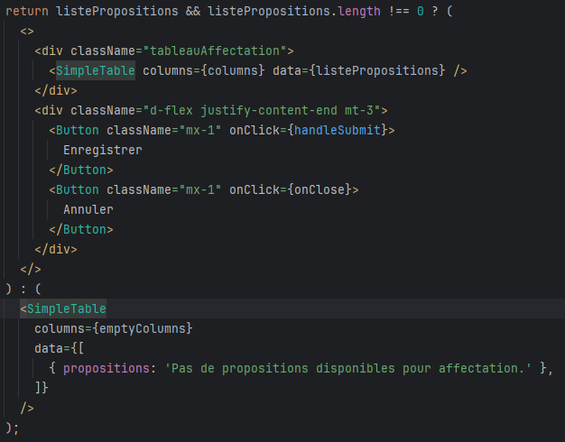

- Apres :  
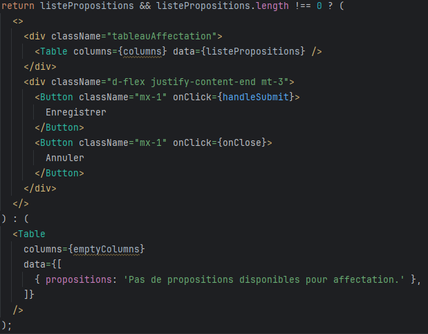

---

### Migration des  composants Tooltip

- Avant :  
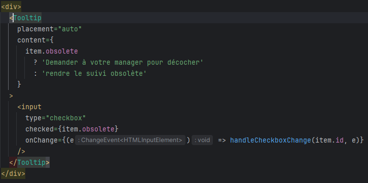

- Apres :  
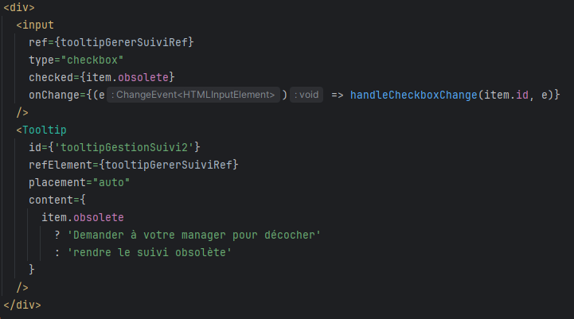

---

### Migration des composants PopIn

- Avant :  
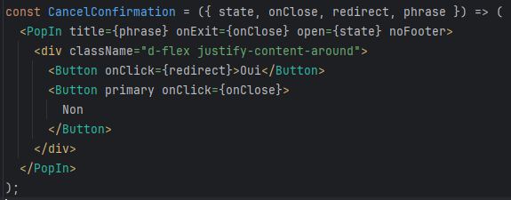

- Apres :  
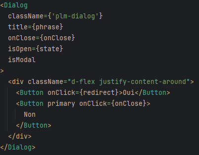

---

### Migration des composants RadioGroup

- Avant :  
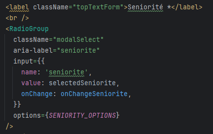

- Apres :  
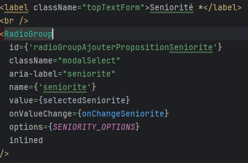

