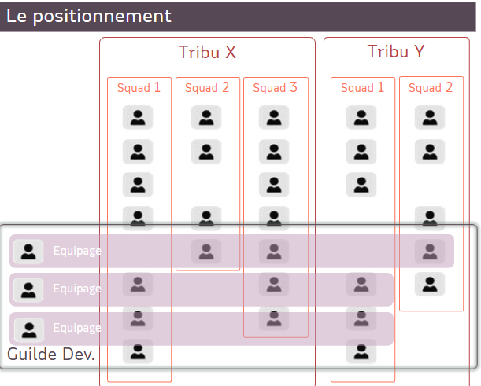

# L'environnement Maif

### Les Guildes

**Description :**
Collectif transverse dans l’entreprise construit autour d’un domaine Métier, d’un champ de pratiques ou d’intérêt(s) dont les membres peuvent être répartis dans différents collectifs. Elle s’assure de la cohérence des pratiques et leur partage dans l’entreprise tout en favorisant le développement des savoirs et savoirs-faire​.

### Les Tribus

**Description :**
Regroupement de Squads ayant un objectif ou produit commun (collectif regroupant au maximum 100 personnes réparties dans une dizaine de Squads). Elle peut naître du découpage d’un Produit portant un niveau de complexité qui ne peut être géré par une seule Squad, ou bien naître d’un regroupement de Produits étant de natures proches (mêmes utilisateurs/partenaires adressés ou proximités fonctionnelles).

### Les Squads

**Description :**
Equip pérenne ayant vocation à délivrer collectivement des éléments de valeur, à gérer un ou plusieurs Produit(s) sur tout son cycle de vie. Elle incarne la maille de base autour du Produit en relation et au service de ses utilisateurs.

### Les Responsables d'Equipage (RE)

**Description :**
En charge de faire grandir et rayonner un ensemble de compétences répondant à un même métier, à l’échelle de plusieurs Tribus. Il a la responsabilité du développement des compétences métiers et les parcours de mobilité des membres qui composent son Equipage.

### En image : 

### Position de l'équipe

L'équipe de l'appli sourcing n'est pas intégrée à une tribu, elle travaille sur les applications utiles pour la guilde de développement.