# Stage Maif: développement d'une application de sourcing

### Environnement

[La MAIF](./environnement-maif.md)

---

### Description

Cette application a pour but de centraliser les besoins en collaborateurs externes des équipes (nommés DEMANDES) et les profils proposés par les ESN (nommés PROPOSITIONS) afin de remplacer les multiples outils actuellement utilisés dans cet objectif par les RE et leurs assistantes.

---

### Mission 

La mission de l'équipe est de centraliser le recueil des besoins de sourcing des tribus, la gestion des propositions des ESN et le suivi des qualifications au sein d'une même appli pour faciliter le travail des RE et des assistantes.

---

### Equipe

Equipe lors de mon stage :

Fanny : Représentante des utilisateurs : Teste l’appli – écrit les HU  
Benoit : PO : Admin du github – Alimentation du backlog avec des HU – teste – donne les objectifs des sprints  
Alexandre : Dev (squad SCAV) : Support technique dev –revues – validation des PR – tutorat technique (pour apprendre à faire des PR, …)  
Manison : Dev (Squad SWAP) : Support tech – codage – déploiement – config openshift – rôle d’OPS

Autre : Les RE dev : représentants utilisateurs à convier aux démos pour feed back

---

### Outils

- un outil de [gestion de tâches : Jira](../Exemples/organisation-jira.md) 
- un outil de [conversation : Teams](../Exemples/echanges-enrichissants.md)

---

### Ce qui existait

À mon arrivée sur le projet, l'application était divisé en deux parties principales : 
- Les Demandes
- Les Propositions

Les deux parties avaient approximativement les mêmes fonctionnalités de disponibles :  
- Tableau
- Ajout
- Modification
- Filtrage
- Export

#### 📸 Captures d’écran

##### <u>Demandes</u>

- Tableau avec filtres :  
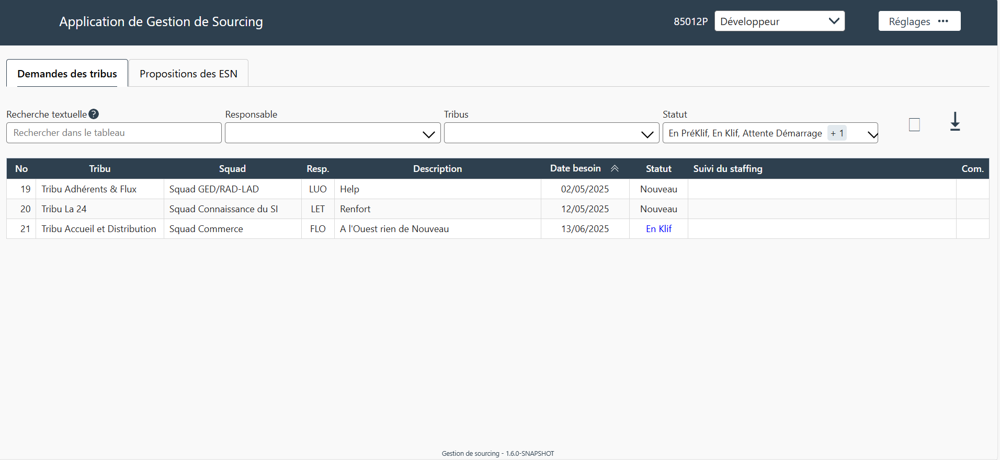

- Ajout :  
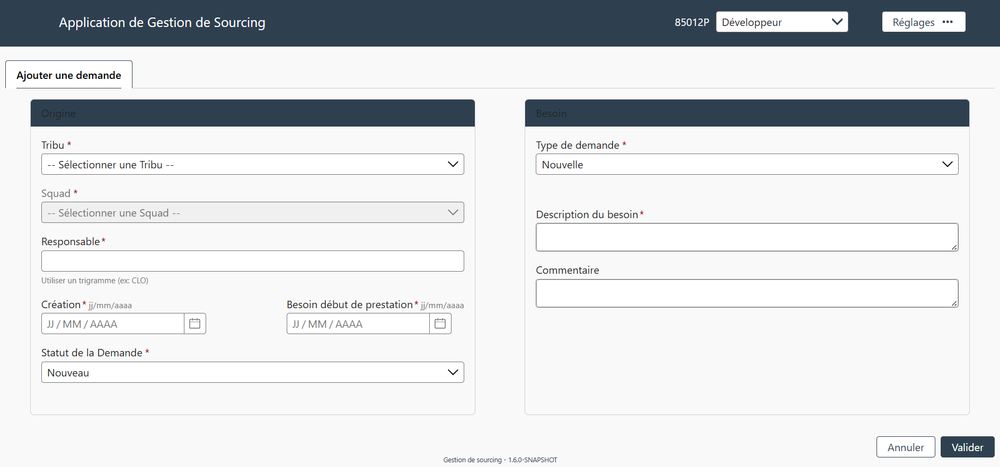

- Modification :  
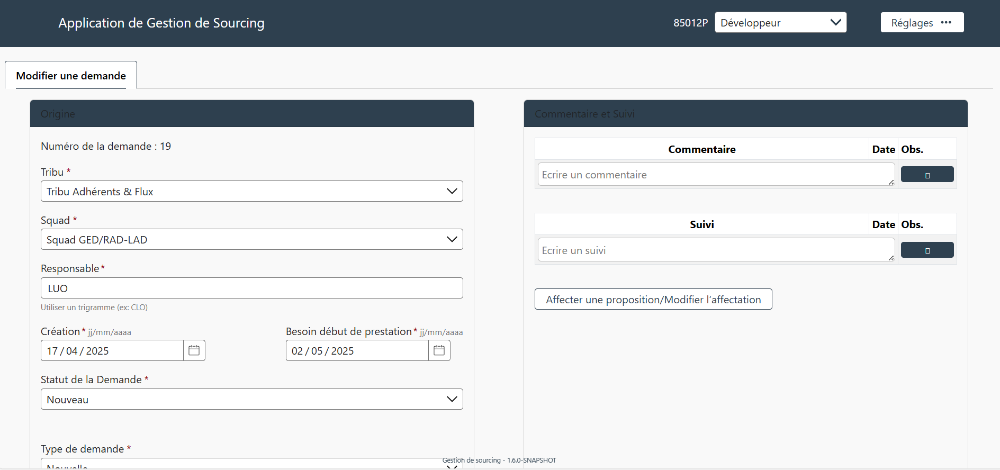

- Export :  
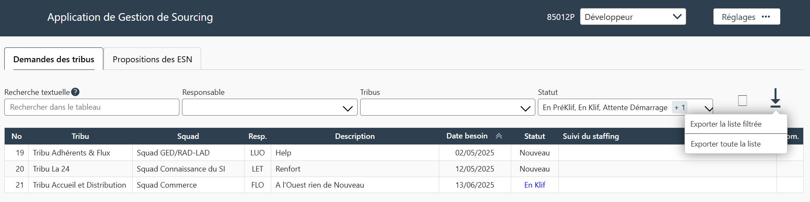
- 
##### <u>Propositions</u>

- Tableau avec filtres :  
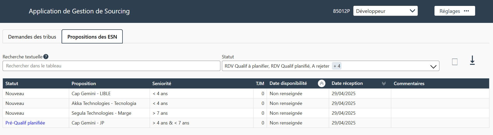

- Ajout :  
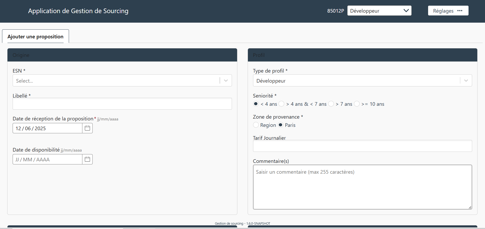

- Modification :  
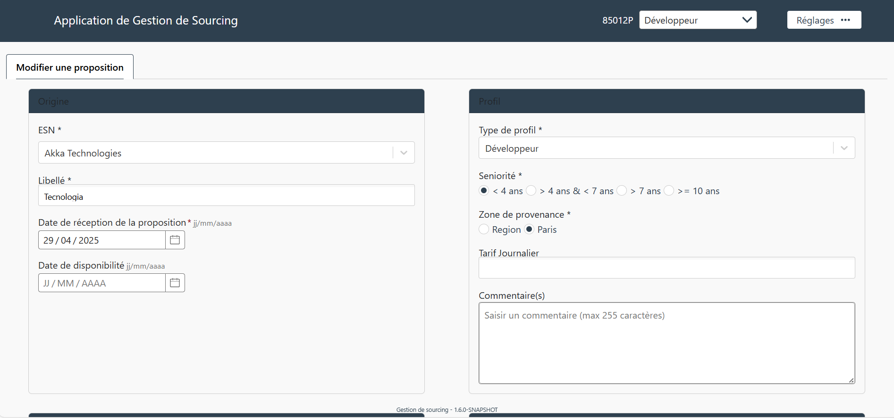

- Export :  
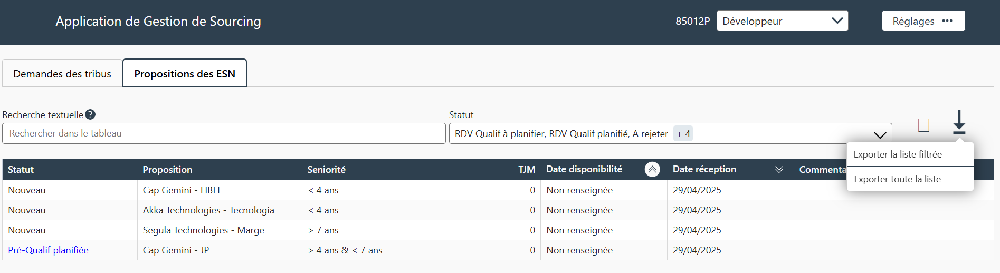

---

### Ce que j'ai réalisé

Afin de me familiariser avec le projet, j'ai commencé par corriger quelques bugs d'affichage mineurs :  

- Texte illisible :  
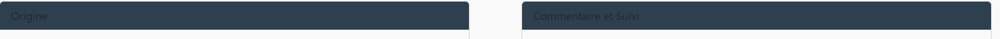
- Corrigé :  
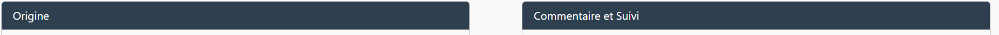

- Carte décentrée :  
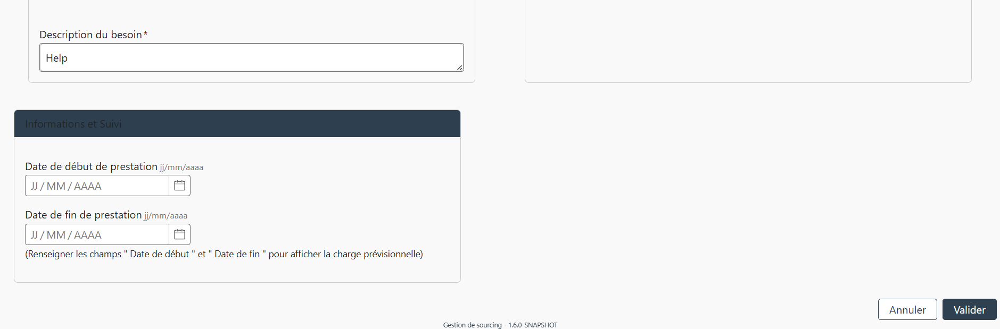
- Corrigé :  
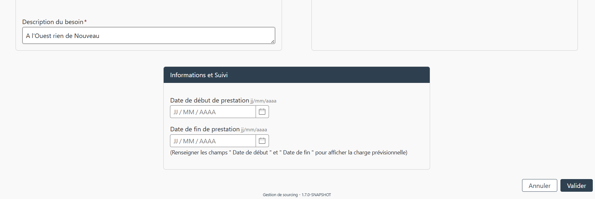

Ensuite, j'ai pu m'occuper de fonctionnalités plus importantes : 

- [Ajout d'une colonne dans un tableau afin d'afficher des pièces jointes](../Exemples/feat-colonne-PJs.md)
- [Ajout d'une fonctionnalité d'archivages multiples](../Exemples/feat-archivage-multiple.md)
- [Migration / Refactorisation de composants](../Exemples/refacto-rmc-plume.md)
- [Création d'une partie 'Staffing' expérimental](../Exemples/feat-staffing.md)

